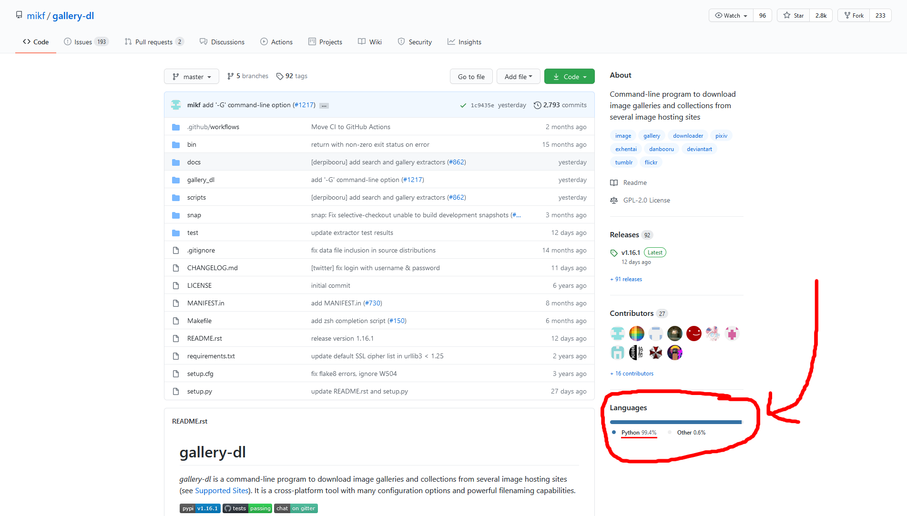
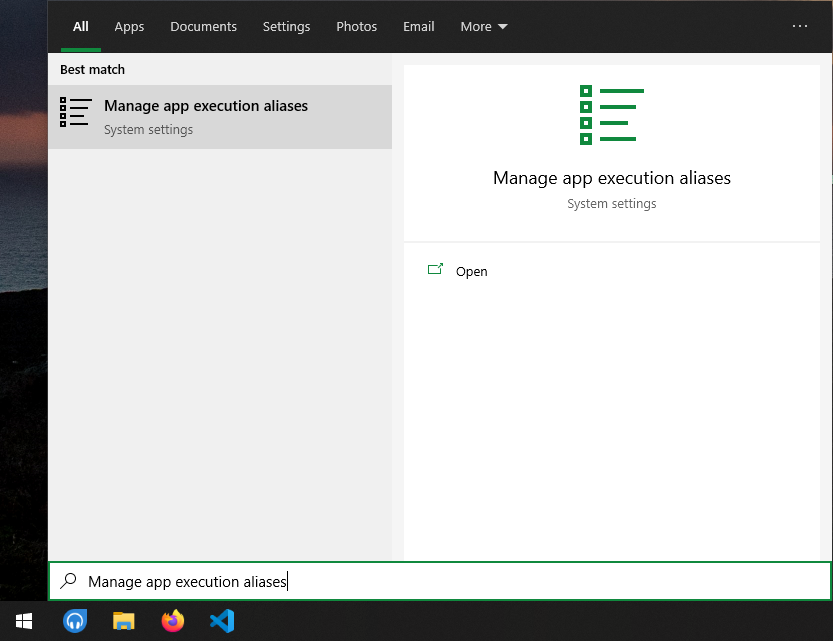
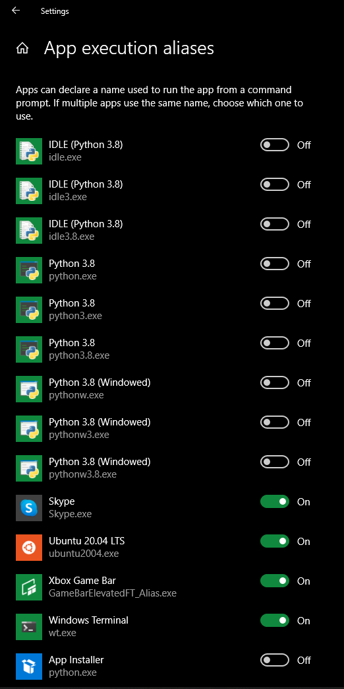
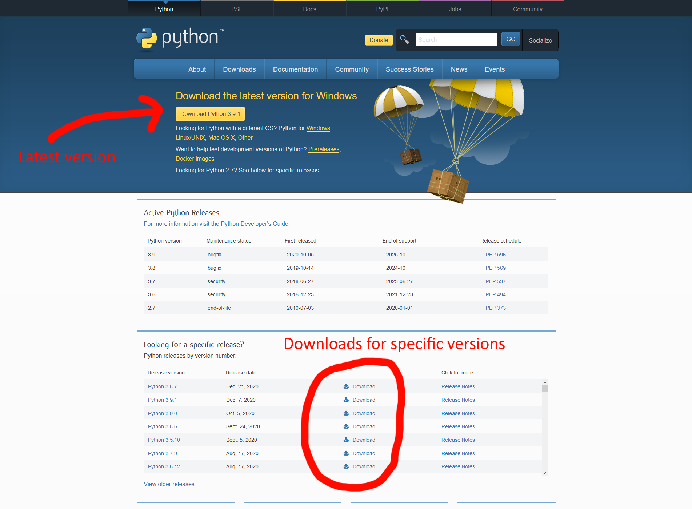
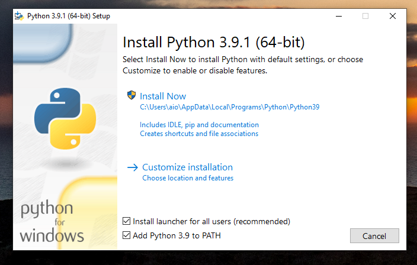
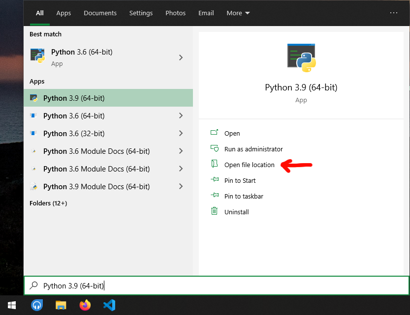
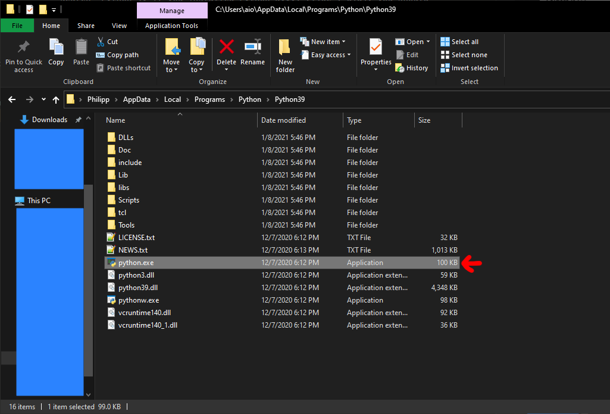
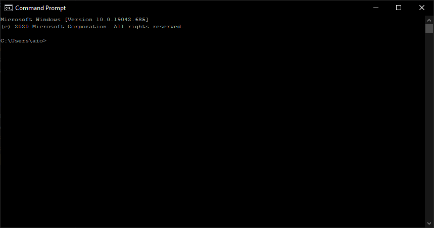
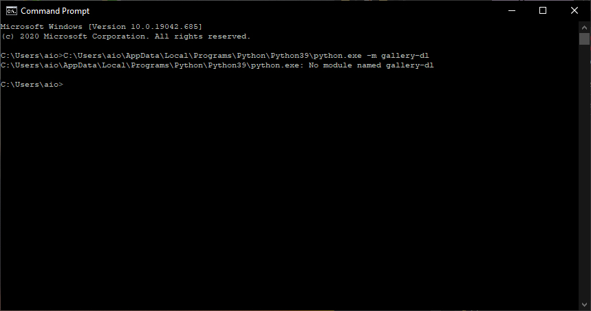
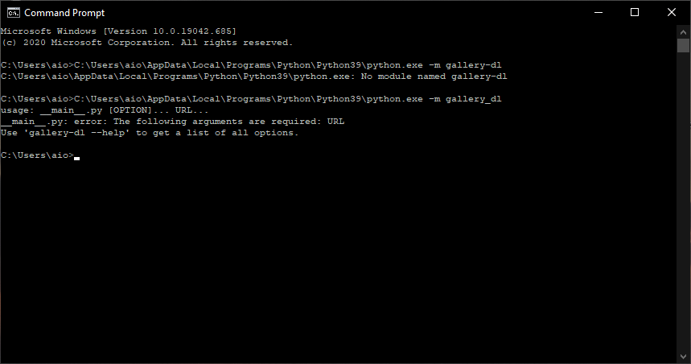

In the past weeks people often asked me how to run a python script they found on GitHub. So here's a full guide on how to do that and which pitfalls exist and how to avoid them.

I will explain all necessary details you need to know to get it running using examples, screenshots and videos.

But before starting please make sure the following is true:
- You're using Windows 10
- The project you're trying to run is using Python as programming language. GitHub will show a "Languages" section at the right side of the project page, which should look like this:



So here's our plan:

1. [Preparation](#preparation)
2. [Install Python](#python-installation)
3. [Install the script you want to run](#script-installation)
4. [Run the script](#script-run)

If anything unexpected happens along the way, you can also jump to the [help section](#it-doesnt-work) to see if there's a tip for you.

### Preparation {#preparation}
In the beginning, we will need to prepare some settings to make sure the installation process works correctly.

#### Disabling preinstalled aliases
Windows 10 comes with certain shortcuts preinstalled, which can be annoying when starting a python script. This is why we disable them.

To do so, search for "Manage App execution aliases" in the Windows 10 search bar typically located at the lower left side: 



In this settings window, we'll disable everything that has to do with Python, which includes "python", "idle" and the app installer that also mentions "python.exe". After that, it should look similar to this:




### Install Python {#python-installation}
Now that we prepared everything, we can proceed by installing Python. Python is the programming language used by the project we want to use. Later, we'll basically tell the "python" program to start the program we got from GitHub.

To start off, we might need to know which version to install. Do a quick check if the program you want to use mentions a specific version (e.g. "above version 3.4" or "use python version 3.8 or higher"). If it doesn't mention the version, just choose the newest one.

#### Download
Head over to [the official download page](https://www.python.org/downloads/) and either download the newest version or choose the version that was specified on the projects' page:



If you choose a specific version, you'll get to the download page of that version. Find the "Files" section there and click on "Windows installer (64-bit)": 


#### Installation
Now that we downloaded the correct package, we need to run the installer.
Make sure the "Add Python to PATH" box is checked and continue with "Install Now".



If you get an error during the installation, you might want to start the installer again, but with admin rights from the beginning. To do that, right-click the file and choose "Run as administrator".

#### Finding python {#finding-python}
Now use the Windows 10 search bar to make sure python is installed (just search "Python"). If you installed Python 3.9.1 (like I did), you should find it there. Please note that the other versions shown here are **not important for us** and you only need the one you installed.



After clicking on the right arrow near the program name, the menu shown here should come up. There, we'll click "Open file location". 

A new window should open with a file listing. There, we right-click on the selected file and again open its file location: 


This will lead to the directory we actually need. One file named "python" will already be selected:



Please keep this window open for later, we'll need it.

### Script installation {#script-installation}
Now everything is prepared and we can finally install the actual script. 

This is where your part will likely be a bit different from what I'm doing, but the general stuff should be the same.

The project you want to use likely has installation instructions. You should follow them, but to do that you need to know several things:

##### Open Command prompt 
Instructions are often written as commands issued to the computer. 

They might look like this:

    pip install -U gallery-dl

or 
    
    python -m pip install -U gallery-dl

or 

    python3 script.py

or

    python script.py

You have to type these into the command prompt, which is a window we'll open next. Type in "cmd" in the search bar and open it.


It's just a window where we can type in text: 



Now we have at least three windows open:
- The one that contains the "python" / "python.exe" file (we opened it in ["Finding python"](#finding-python) before)
- The command prompt window we just opened
- Your browser with this page and the project page

##### Script installation
Here comes the part where we actually install the program we want to use. 

Let's image I wanted to download all images from [this Flickr account](https://www.flickr.com/photos/spacex/). I found the command-line tool [gallery-dl](https://github.com/mikf/gallery-dl) on GitHub and want to install it.

Its installation instructions mention the following:

    pip install -U gallery-dl

When you type that into the command line, it *might* work. To make sure it works 100% sure, we have to do some extra steps:

1. Drag & drop the "python" file from our opened window into the command prompt. This will fill in a long path.
2. Write a space character (just " ", without quotes) in the command prompt window 
3. This would start `python`, but we want to start `pip` (first word in the command above). We tell python to start pip by adding `-m`, then our actual command (`pip install -U gallery-dl`) that should be started. This is the command we actually type in:
```
C:\directory\python.exe -m pip install -U gallery-dl
```

Here's a quick video on how it works:

<p>
<video controls muted style="width:100%;height:100%;margin-left:auto;margin-right:auto;object-fit:cover">
    <source src="vids/drag-drop-python.webm" type="video/webm">
    <source src="vids/drag-drop-python.mp4" type="video/mp4">
    Your browser does not support the playing these videos.
</video></p>

In general you'll be given some commands you should type in to install. For each command, we try the following schema.

If the it starts with...
- `python` / `python3`: drag & drop python in the command prompt window, add a space and then copy everything after the word `python` / `python3` in there (add a space between the long python path and everything else)
- `pip` / `pip3`: you want to drag & drop python in the window, then write a space, then `-m pip`, then another space and then everything after `pip` / `pip3`
- anything else: you likely have to do the same as above, add ` -m ` and then type in/paste the whole command. If it doesn't work on the first try replace any `_` (after `-m`) with `-` (or vice-versa)

Now type in all commands that are given/required by the authors of the script.

If you ever accidentally press enter too early and now you're stuck in python's interactive mode (the line where you type will start with `>>>`), you can type in `exit()` to get back to the normal command line.

### Run the script {#script-run}
The project page mentions that I can run gallery-dl by typing this in the command prompt:

    gallery-dl 

We now drop python in the command prompt again, add ` -m ` and then finally add the command from above:



Oh no, it couldn't be found! One thing we can try in such a case is replacing the dash `-` with an underscore `_`, e.g. `gallery-dl` becomes `gallery_dl`. You can also try it the other way around, e.g. `youtube_dl` becomes `youtube-dl`. Often one of these tricks works.

And... it worked!



But there's still an error because we didn't tell the program what to do.
Note that it also tells us that we can add ` --help` at the end "to get a list of all options", as in the program will tell us what it can do (and how we specify it).

##### Command-line arguments
Most command-line programs don't ask interactively what they are supposed to do, they expect you to tell them from the start. 

In the case of `gallery-dl` it's the following pattern:

```
usage: __main__.py [OPTION]... URL...
```

The `__main__.py` part could also be just the name of the program, as in:

```
usage: gallery-dl [OPTION]... URL...
```


`[OPTION]` means that there are **optional** (because of the brackets `[]`) options we can use.

`URL...` means that `gallery-dl` for example expects **one or multiple** (because of the dots `...`) URLs of galleries to download. 

The order of these is important for most programs. As in the options (if any) come first, then anything else (e.g. URLs, filenames). 

Sometimes there are options that are together with a filename (or any text really), e.g. `gallery-dl`'s `--write-log` option:

    --write-log FILE          Write logging output to FILE

This means that when we write `--write-log`, the next text (after a space) must be filename. You would write it like this:

```
C:\directory\python.exe -m gallery_dl --write-log "log-file.txt" "https://www.flickr.com/photos/spacex/"
```

##### Starting the program
But if we want a simple download, we add the URL to the end of the command:

```
C:\directory\python.exe -m gallery_dl "https://www.flickr.com/photos/spacex/"
```

Also, when writing an URL (or file path) like this in the [command line arguments](https://en.wikipedia.org/wiki/Command-line_interface#Arguments) of a program I recommend putting quotes `"` around it as done above.

<p>
<video controls muted style="width:100%;height:100%;margin-left:auto;margin-right:auto;object-fit:cover">
    <source src="vids/gallery_dl_start.webm" type="video/webm">
    <source src="vids/gallery_dl_start.mp4" type="video/mp4">
    Your browser does not support the playing these videos.
</video></p>

So that seems to work!

... but wait. Where did it save these images?

If your program doesn't show a path or a relative path (those with `.\` at the beginning, those that start **without** a drive letter like `C:\...`), the files will likely be saved in the same directory that is shown at the beginning of your command prompt (in my case it's `C:\Users\aio`).

We can open that directory by typing `explorer .` in the command prompt and pressing enter.

If we're looking for the image with the path `.\gallery-dl\flickr\Official SpaceX Photos\flickr_16169086873.png`, we should find a directory called `gallery-dl` in our opened folder. There is a `flickr` folder, then another `Official SpaceX Photos` folder and then there's a bunch of images. That's where we wanted to go.

### Configuration
There are often cases where the "normal"/easiest way to start a program (just adding the URL after the start command) is not enough.

Often the help page can be seen by starting the program with `--help`

```
C:\directory\python.exe -m gallery_dl --help
```

There you can find more options to start a program. I for example want to download the profile, but `gallery-dl` should also put it in a ZIP file. So I found this in the help text:

```
Post-processing Options:
  --zip                     Store downloaded files in a ZIP archive
```

Now I run this command with the correct order of arguments:

```
C:\directory\python.exe -m gallery_dl --zip "https://www.flickr.com/photos/spacex/"
```

And that was fast! Instead of spending way too long to download every image separately, we just instructed `gallery-dl` to do everything for us.

##### An additional tip
Instead of always opening the directory where python is located, then dragging it in the command prompt window, you could try this alternative (that might not work):

Instead of the full path, just write `py` in front of the program name, like
```
py -m gallery_dl --help
```

This shortcut can be quite nice if it's there. But if it isn't there you have to use the other method.

---

### Something doesn't work {#it-doesnt-work}
When *something* doesn't work, it can be quite frustrating and confusing. That's normal.

Here are some things you can do:
- Search the internet for your error message. Often adding the script name (e.g. `gallery-dl`) to the search yields results from people who have run into similar errors
- Look on the project page if there are any hints.
- Go to the "Issues" tab of the projects' GitHub page and type the error message in the search bar. Often someone else already created an issue with details. If not, you can create one. Most projects are happy to answer any question you have.
- Use an alternative program that does the same. Often older projects that weren't updated in the last few months are no longer worked on and would require changes to work again. Don't bother with that and search for another program.
- You can ask on forums or Reddit how you would do a certain thing with a certain program


However, it could of course also mean that this guide is incomplete or has errors.
If you think this is the case, please feel free to [open an issue](https://github.com/xarantolus/blog/issues) or write an e-mail to <span id="mail-span"></span><script>document.getElementById('mail-span').innerText = atob('eGFyYW50b2x1c+RwbS5tZQ==').replace('ä', String.fromCharCode(8*8))</script><noscript>[not available without JavaScript]</noscript> (you can also find the address at [my GitHub profile](https://github.com/xarantolus)). Please also feel free to open an issue/write a mail for any minor comments, feedback etc.

Thank you :)
